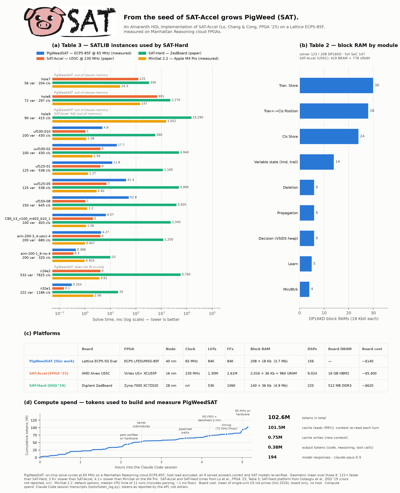

<p align="center"></p>

# PigWeedSAT

*An Amaranth HDL Implementation of SAT-Accel on the Lattice ECP5.*

PigWeedSAT reimplements the SAT-Accel CDCL SAT solver (Lo, Chang & Cong,
FPGA '25; HLS sources `openhw-2025-SAT-FPGA/hls/src`, originally for an AMD
U55C) in **Amaranth HDL** for a **Lattice ECP5-85F**, and runs it on
[Manhattan Reasoning](https://docs.manhattanreasoning.com) cloud FPGAs.
(Amaranth is a genus of pigweed.)



<sub>[PDF version](docs/pigweedsat_results.pdf) · regenerate with `python -m satlat.figure`</sub>

## Results (cloud ECP5-85F, 65 MHz)

On the SATLIB instances of the SAT-Accel paper's Table 3, every instance that
fits on-chip is solved correctly (SAT models re-verified on the host), and the
hardware's decisions, conflicts and restarts match the golden model exactly.

| | geometric mean over the 9 solved instances |
|---|---|
| vs. SAT-Hard (ZedBoard, paper) | **122× faster** |
| vs. SAT-Accel (Alveo U55C @ 230 MHz, paper) | 3.9× slower |
| vs. MiniSat 2.2 (Apple M4 Pro, measured) | 4.1× slower |

hole7–9 run out of on-chip clause memory (`-4`, as hole9 also does for
SAT-Accel on the U55C) and ii16e2 does not fit the ECP5's 3.7 Mb of block RAM.
Full numbers: `build/table3_hw.json`, `build/paper_tables.md`.

## Architecture

`design.py` is one self-contained file (the platform uploads only that) with
one Amaranth `Elaboratable` per HLS kernel:

| module | HLS source |
|---|---|
| `SATAccel` (top) | `solver.cpp` solve loop, FIND_TOP; `timer.cpp` phase counters |
| `Propagator` | `decide.cpp`, `discover.cpp`, `color.cpp` — pipelined, 1 clause/cycle |
| `Learner` | `learn.cpp` — 1-UIP resolution, findNextCls, backtrack level |
| `Backtracker` | `backtrack.cpp` — pipelined undo, runs **concurrently** with the Minimizer |
| `Minimizer` | `minimize.cpp` — recursive clause minimization |
| `ClauseSaver` | `clause_store_handler` SAVE/BUCKET, `writeClauseStream`, `allocatePage` |
| `Pruner` | `clause_store_handler` DELETE, `deleteTransposedClauses`, location UPDATE |
| `PriorityQueue` | `pq_handler.cpp` VSIDS heap behind a command FIFO |
| `FreeList`, `LbdBuckets`, `Restart` | `mmuStream` free lists, LBD deletion buckets, Luby restarts |
| `HostInterface`, `Memories` | Wishbone register file; all solver RAMs with per-kernel ports |

Data structures are the originals (paged literal and clause stores, XOR-compressed
clause states, location maps), sized for the ECP5: 2,048 variables, 4,096
clauses, 16K-word stores (constants at the top of `design.py`).  Deviations from
the HLS are listed in `satlat/golden.py`.

Resources (full SoC incl. the platform's CPU and Ethernet): 150/208 DP16KD,
~21K/84K LUT, 7 DSP; user clock 65 MHz (Fmax ≈ 77 MHz).

## Heuristics

On top of the HLS algorithm, five heuristics from MiniSat, Glucose and Kissat.
Each is enabled by its own register, so one bitstream runs both the faithful
HLS algorithm (all off, the default) and PigWeedSAT's
(`satlat.host.pigweed()`):

| `Config` field | from | what it does | where |
|---|---|---|---|
| `low_cls_pages`, `low_lit_pages` | Kissat/Glucose `reduce` | restart + prune whenever free clause or literal pages fall below a watermark, not only on Luby restarts | `SATAccel` RST |
| `glue_buckets` | Glucose | pruning never deletes clauses with LBD ≤ 2 | `Pruner` |
| `used_bit` | Kissat | a clause used in conflict analysis since the last prune is requeued once instead of deleted | `Learner`, `Pruner` |
| `min_abstract` | MiniSat `abstractLevel` | the minimizer rejects literals from levels absent in the clause and stops a walk at its first failure; the learned clauses are unchanged | `Learner`, `Minimizer` |
| `rephase` | Kissat best phases | saves the phases of the longest conflict-free trail; every N conflicts resets phases to best / original / best / inverted | `Backtracker`, `SATAccel` RPH |

`pigweed()` enables the first four (watermarks 256 / 32 pages). Rephasing is
implemented but off: in the golden-model sweep it cut conflicts ~10% alone,
but nothing once the used bit is on.

On the board (`MODES=hls,pigweed mrg run bench_table3.py`, same bitstream,
`build/table3_hw_pigweed.json`): **hole7 is now solved** (UNSAT, 327 ms,
4,569 conflicts; the HLS algorithm runs out of clause memory); the nine
instances both modes solve are 1.13× faster in geometric mean (0.62×–4.0×,
mostly from different search paths); hole8/9 still run out of memory, after
3.4M / 5.4M conflicts. The abstract-level filter halves the minimizer's work
without changing the search, but the minimizer runs alongside the Backtracker,
which is the slower of the two, so the phase barely shortens.

## Verification

`satlat/golden.py` is a sequential reference model of exactly what the RTL
executes; `satlat/rtlsim.py` simulates the Wishbone-level design cycle-accurately
and compares every solver counter against it, including back-to-back solves
(block RAM is not cleared between solves on hardware).

```sh
python -m venv .venv && .venv/bin/pip install manhattan-reasoning-gym amaranth==0.5.8 pytest matplotlib
docker pull ghcr.io/manhattanreasoning/mrg-sandbox:latest

.venv/bin/pytest -q tests                                   # unit, golden, RTL-vs-golden
.venv/bin/python -m satlat.rtlsim SAT_test_cases/sat/uf20.dimacs
.venv/bin/mrg pnr design.py --sys-clk-mhz 65                # full-SoC fit + timing
tools/critpath.sh 80                                        # critical path summary
```

## Running on hardware

```sh
mrg login
MRG_SYS_CLK_FREQ=65000000 .venv/bin/mrg run bench_table3.py   # Table 3 -> build/table3_hw.json
.venv/bin/mrg run app.py                                      # the bundled test cases
.venv/bin/mrg reset <fpga_id>                                 # release the board
.venv/bin/python -m satlat.report                             # tables -> build/paper_tables.md
.venv/bin/python -m satlat.figure                             # figure -> build/
```

`tools/fetch_satlib.sh` re-downloads the SATLIB archives; `tools/token_log.py`
tallies the Claude Code tokens spent on the project (figure panel d).

## Layout

| path | what |
|---|---|
| `design.py` | the hardware |
| `satlat/host.py` | port of `host.cpp` `parseDIMACS`: CNF -> paged memory images |
| `satlat/golden.py` | reference model |
| `satlat/driver.py` | load / solve / read back over any bus (`CloudBus` = mrg stream) |
| `satlat/rtlsim.py` | RTL simulation vs. golden |
| `satlat/report.py`, `satlat/figure.py` | paper tables and figure |
| `bench_table3.py`, `app.py` | `mrg run` entry points |
| `benchmarks/satlib/` | the Table 3 SATLIB instances (`table3_clean/` without the `%` trailer) |
| `SAT_test_cases/` | test cases from openhw-2025-SAT-FPGA |

## Host protocol

Word registers (byte address = 4 × word): `0` CTRL (W bit0 start / R bit0
busy, bit1 done), `1` RESULT (1 SAT, 0 UNSAT, <0 HLS error), `2..11` config,
`12..14` MEM_SEL / MEM_PTR / MEM_DATA, `16..23` capabilities + magic,
`24..28` heuristics (LOW_CP, LOW_LP, GLUE, FLAGS = used | min_abstract << 1,
REPHASE), `32..53` statistics, `64..81` per-phase cycle counters. Words 256..511 alias
MEM_DATA so a normal 256-word burst streams a memory.

## License

Apache License 2.0 — see `LICENSE` and `NOTICE`. PigWeedSAT is derived from
the Apache-2.0 openhw-2025-SAT-FPGA (SAT-Accel) sources.
